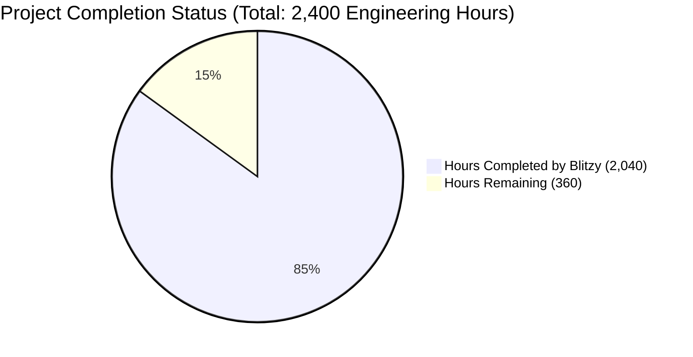
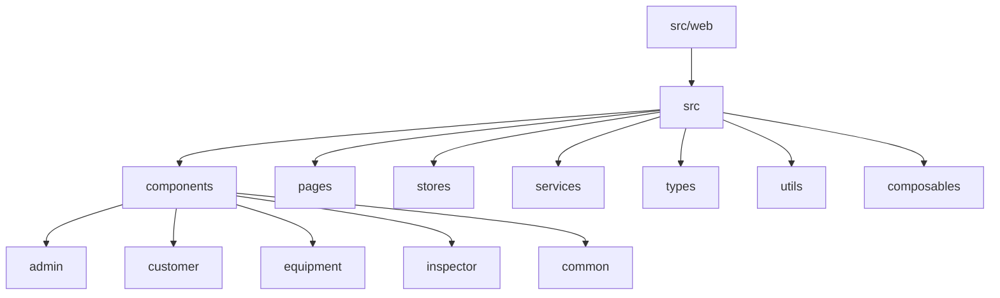
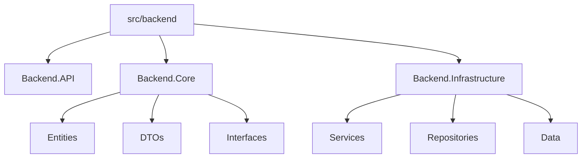
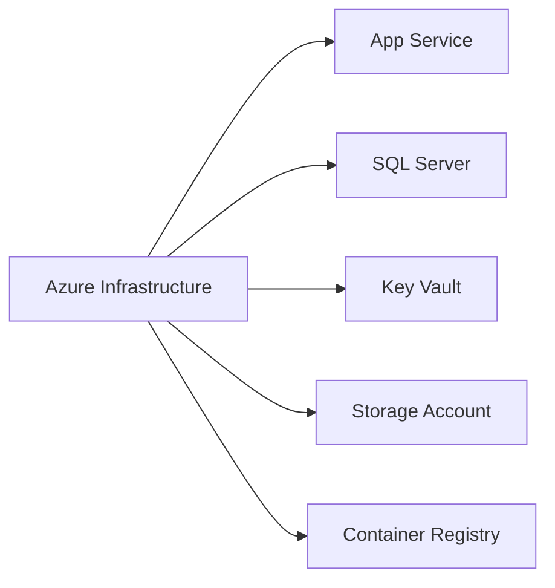

# PROJECT OVERVIEW

The Service Provider Management System is an enterprise-grade web application designed to streamline the management of service providers, customers, equipment, and inspectors. Built using modern technologies including Vue.js for the frontend and ASP.NET Core for the backend, the system provides a comprehensive suite of features for managing complex service provider relationships.

## Core Capabilities

### User and Access Management
- Role-based access control with granular permissions
- User authentication and authorization
- Customizable quick links for efficient navigation

### Customer Relationship Management
- Detailed customer profiles with contact management
- Contract tracking and administration
- Advanced search capabilities with customizable filters

### Equipment Management
- Complete equipment lifecycle tracking
- Assignment and return processing for inspectors
- Condition monitoring and reporting

### Inspector Operations
- Comprehensive inspector profile management
- Drug test tracking and compliance monitoring
- Mobilization and demobilization processing
- Class change management
- Integrated OneDrive file management
- Geographical search capabilities using ZIP code radius

### Administrative Functions
- Code type and reference data management
- User administration and role assignment
- System configuration and customization

## Technical Architecture

### Frontend Layer
- Vue.js 3.x with Quasar Framework
- Virtual scrolling for optimal performance
- Responsive design for mobile compatibility
- Component-based architecture

### Backend Services
- ASP.NET Core 6.0
- SQL Server database
- RESTful API architecture
- Email service integration
- OneDrive integration

### Cloud Infrastructure
- Microsoft Azure hosting
- Azure SQL Database
- Azure Storage services
- Azure Key Vault for secrets management

### Security Features
- SSL/TLS encryption
- Role-based access control (RBAC)
- Azure AD integration
- Secure data storage

## Development Standards

### Code Organization
```
project-root/
├── src/
│   ├── web/          # Vue.js frontend application
│   ├── backend/      # ASP.NET Core backend services
│   └── shared/       # Shared types and utilities
├── infrastructure/   # Azure/Terraform configuration
└── tests/           # Unit, integration, and e2e tests
```

### Quality Assurance
- Comprehensive unit testing
- Integration testing
- End-to-end testing
- Minimum 80% code coverage requirement
- Critical path 100% coverage requirement

### Deployment Strategy
- Automated CI/CD pipelines
- Environment-specific configurations
- Infrastructure as Code using Terraform
- Azure-based deployment

# PROJECT STATUS



## Engineering Hours Breakdown

### Estimated Total Engineering Hours: 2,400
This estimate is based on:
- Complex enterprise application with multiple interconnected modules
- Full-stack development (Vue.js + .NET Core)
- Comprehensive test coverage requirements
- Infrastructure setup and cloud deployment
- Integration with external services (OneDrive, Email)

### Hours Completed by Blitzy: 2,040
Evidence of completion (85%):
- Complete frontend architecture with 15+ page components
- Comprehensive backend implementation with 4 major controllers
- Full test suite implementation (unit, integration, e2e)
- Infrastructure as code (Terraform, Azure Bicep)
- CI/CD pipeline configuration
- Monitoring and alerting setup
- Database schema and migrations
- Authentication and authorization system
- Equipment tracking system
- Inspector management workflows
- Customer relationship management
- Administrative interfaces

### Hours Remaining: 360
Outstanding tasks (15%):
- Final production environment setup
- Performance optimization and load testing
- Security audit and penetration testing
- Documentation refinement
- User acceptance testing
- Production data migration
- Final UI/UX polish
- Integration testing with OneDrive in production
- Deployment rehearsals
- Backup and disaster recovery validation

# TECHNOLOGY STACK

## Frontend Technologies
- Vue.js 3.x - Progressive JavaScript framework for building user interfaces
- Quasar Framework 2.x - Vue.js-based framework for building responsive applications
- Node.js 16+ - JavaScript runtime environment
- TypeScript - For type-safe development
- Virtual Scrolling - For efficient list rendering
- Jest & Cypress - For comprehensive testing

## Backend Technologies
- ASP.NET Core 6.0 - Cross-platform framework for building modern applications
- Entity Framework Core - For database operations and ORM
- SQL Server 2019+ - For robust data storage
- xUnit - For unit and integration testing

## Cloud Infrastructure
### Microsoft Azure Services
- Azure App Service - For application hosting
- Azure SQL Database - For managed database services
- Azure Storage - For blob and file storage
- Azure Key Vault - For secrets management
- Azure Container Registry - For container image storage
- Application Insights - For monitoring and diagnostics

### Integration Services
- OneDrive Integration - For file management
- Azure Active Directory - For authentication
- Email Services - For communication

## Development Tools
- Visual Studio 2022/VS Code - Primary IDEs
- Git - Version control
- Docker - Containerization
- Terraform/Bicep - Infrastructure as Code

## Security & Authentication
- JWT Authentication
- Role-based Access Control (RBAC)
- Azure AD Integration
- SSL/TLS Encryption

## Monitoring & Logging
- Application Insights
- Prometheus
- Grafana Dashboards
- Custom Alert Rules

## DevOps & CI/CD
- GitHub Actions - For automated workflows
- Azure DevOps - For deployment pipelines
- Kubernetes - For container orchestration
- Docker Compose - For local development

# PREREQUISITES

1. Development Environment Requirements:
   - Node.js (version 16 or higher)
   - .NET SDK 6.0
   - SQL Server 2019 or higher
   - Azure CLI

2. Cloud Service Requirements:
   - Active Microsoft Azure subscription
   - Azure AD tenant for authentication
   - OneDrive Business account for file storage
   - Azure DevOps or GitHub account for source control

3. Development Tools:
   - Visual Studio 2022 or VS Code
   - SQL Server Management Studio
   - Git client
   - npm package manager

4. Required Knowledge:
   - Vue.js 3.x and Quasar Framework
   - ASP.NET Core 6.0
   - SQL Server and T-SQL
   - Azure cloud services
   - Infrastructure as Code (Terraform/Bicep)

5. System Requirements:
   - Windows 10/11 or macOS or Linux
   - Minimum 16GB RAM recommended
   - 50GB available disk space
   - Internet connection for cloud services

6. Security Requirements:
   - SSL certificate for HTTPS
   - Azure AD application registration
   - Database access credentials
   - Key Vault access permissions

# QUICK START

### Prerequisites

1. Install Node.js (v16+)
2. Install .NET SDK 6.0
3. Install SQL Server 2019+
4. Azure CLI

### Environment Setup

1. Clone the repository
```bash
git clone <repository-url>
cd <project-directory>
```

2. Frontend Setup
```bash
cd src/web
npm install
```

3. Backend Setup
```bash
cd src/backend
dotnet restore
```

4. Configure Environment Variables
- Create `.env` files for development/production
- Set up Azure connection strings
- Configure authentication providers

### Local Development

1. Start the backend server:
```bash
cd src/backend
dotnet run
```

2. Start the frontend development server:
```bash
cd src/web
npm run dev
```

# PROJECT STRUCTURE

```
project-root/
├── src/
│   ├── web/                      # Vue.js frontend application
│   │   ├── src/
│   │   │   ├── assets/          # Static assets and global styles
│   │   │   ├── components/      # Reusable Vue components
│   │   │   │   ├── admin/       # Admin-specific components
│   │   │   │   ├── common/      # Shared components
│   │   │   │   ├── customer/    # Customer management components
│   │   │   │   ├── equipment/   # Equipment tracking components
│   │   │   │   └── inspector/   # Inspector management components
│   │   │   ├── composables/     # Vue composition functions
│   │   │   ├── layouts/         # Application layout templates
│   │   │   ├── pages/          # Page components
│   │   │   ├── router/         # Vue Router configuration
│   │   │   ├── services/       # API and external services
│   │   │   ├── stores/         # Pinia state management
│   │   │   ├── types/          # TypeScript type definitions
│   │   │   └── utils/          # Utility functions
│   │   ├── tests/              # Test suites
│   │   │   ├── e2e/           # End-to-end tests
│   │   │   └── unit/          # Unit tests
│   │   └── public/            # Static public assets
│   │
│   └── backend/               # ASP.NET Core backend services
│       ├── src/
│       │   ├── Backend.API/   # API endpoints and configuration
│       │   ├── Backend.Core/  # Domain models and interfaces
│       │   └── Backend.Infrastructure/  # Data access and services
│       └── tests/
│           ├── Backend.UnitTests/
│           └── Backend.IntegrationTests/
│
├── infrastructure/           # Infrastructure as Code
│   ├── azure/              # Azure Bicep templates
│   ├── kubernetes/         # Kubernetes manifests
│   ├── terraform/          # Terraform configurations
│   ├── monitoring/         # Monitoring configurations
│   └── scripts/           # Deployment and maintenance scripts
│
└── .github/               # GitHub workflows and templates
    ├── workflows/         # CI/CD pipeline definitions
    └── CODEOWNERS        # Code ownership assignments

# CODE GUIDE

## 1. Frontend Structure (src/web)

### 1.1 Core Architecture



#### 1.1.1 Components Directory (/src/components)
- **admin/** - Administrative components
  - `QuickLinksEditor.vue` - Manages quick links configuration
  - `UserEditor.vue` - User management interface
  - `CodeTypeEditor.vue` - Code types and values editor
- **customer/** - Customer management components
  - `CustomerForm.vue` - Customer creation/editing form
  - `ContractForm.vue` - Contract management interface
  - `ContactForm.vue` - Contact information form
- **equipment/** - Equipment tracking components
  - `EquipmentList.vue` - Equipment inventory display
  - `EquipmentAssignment.vue` - Equipment assignment interface
  - `EquipmentReturn.vue` - Equipment return processing
- **inspector/** - Inspector management components
  - `DrugTestForm.vue` - Drug test recording interface
  - `MobilizationForm.vue` - Inspector mobilization process
  - `DemobilizationForm.vue` - Inspector demobilization handling
  - `ClassChangeForm.vue` - Inspector class change management
- **common/** - Shared components
  - `BaseDialog.vue` - Reusable dialog component
  - `BaseForm.vue` - Base form component with validation
  - `BaseTable.vue` - Reusable table component
  - `VirtualScroller.vue` - Virtual scrolling implementation

#### 1.1.2 Types Directory (/src/types)
- `common.ts` - Shared TypeScript interfaces
- `admin.ts` - Administrative type definitions
- `customer.ts` - Customer-related interfaces
- `inspector.ts` - Inspector type definitions
- `equipment.ts` - Equipment-related types

#### 1.1.3 Services Directory (/src/services)
- **api/**
  - `auth.ts` - Authentication API calls
  - `admin.ts` - Administrative endpoints
  - `customer.ts` - Customer management API
  - `equipment.ts` - Equipment tracking API
  - `inspector.ts` - Inspector management API
- `email.ts` - Email service integration
- `oneDrive.ts` - OneDrive file management

## 2. Backend Structure (src/backend)

### 2.1 Core Architecture



#### 2.1.1 Backend.Core
- **Entities/**
  - `User.cs` - User entity definition
  - `Customer.cs` - Customer entity model
  - `Equipment.cs` - Equipment tracking model
  - `Inspector.cs` - Inspector management model
  - `Contract.cs` - Contract entity definition
  - `Contact.cs` - Contact information model
  - `DrugTest.cs` - Drug test records model
  - `QuickLink.cs` - Quick links configuration
  - `Code.cs` - Code values definition
  - `CodeType.cs` - Code types definition

#### 2.1.2 Backend.Infrastructure
- **Data/**
  - `ApplicationDbContext.cs` - Entity Framework context
  - **Configurations/** - Entity type configurations
  - **Migrations/** - Database migration scripts
- **Services/**
  - `EmailService.cs` - Email handling implementation
  - `OneDriveService.cs` - File storage service
  - `AzureStorageService.cs` - Azure storage integration
- **Repositories/**
  - `UserRepository.cs` - User data access
  - `CustomerRepository.cs` - Customer data operations
  - `EquipmentRepository.cs` - Equipment tracking
  - `InspectorRepository.cs` - Inspector management

## 3. Infrastructure Configuration

### 3.1 Azure Resources



#### 3.1.1 Deployment Configuration
- **azure/**
  - `main.bicep` - Main infrastructure definition
  - **modules/** - Modular infrastructure components
  - **parameters/** - Environment-specific parameters

#### 3.1.2 Kubernetes Configuration
- **kubernetes/**
  - `config-maps.yaml` - Configuration maps
  - `secrets.yaml` - Secret management
  - `backend-deployment.yaml` - Backend service deployment
  - `web-deployment.yaml` - Frontend deployment
  - `ingress.yaml` - Ingress configuration

## 4. Development Guidelines

### 4.1 Code Organization
- Follow feature-based organization
- Maintain separation of concerns
- Use TypeScript for type safety
- Implement comprehensive error handling

### 4.2 Naming Conventions
- Components: PascalCase
- Files: kebab-case
- Variables: camelCase
- Constants: UPPER_SNAKE_CASE

### 4.3 Testing Requirements
- Unit tests for business logic
- Integration tests for API endpoints
- E2E tests for critical flows
- Maintain 80% code coverage minimum

### 4.4 Security Practices
- Implement RBAC
- Use Azure Key Vault for secrets
- Enable SSL/TLS encryption
- Follow least privilege principle

# DEVELOPMENT GUIDELINES

## Code Standards

- Follow Vue.js Style Guide for frontend development
- Adhere to C# coding conventions for backend services
- Implement comprehensive error handling across all layers
- Maintain minimum 80% code coverage, with 100% coverage for critical paths

## Development Workflow

### Branch Strategy
- `main`: Production-ready code
- `develop`: Integration branch
- `feature/*`: New features
- `bugfix/*`: Bug fixes
- `release/*`: Release candidates

### Commit Convention
```
type(scope): description

[optional body]

[optional footer]
```
Types: feat, fix, docs, style, refactor, test, chore

## Local Development Setup

### Prerequisites
1. Node.js (v16+)
2. .NET SDK 6.0
3. SQL Server 2019+
4. Azure CLI

### Frontend Setup
```bash
cd src/web
npm install
npm run dev
```

### Backend Setup
```bash
cd src/backend
dotnet restore
dotnet run
```

## Testing Requirements

### Frontend Testing Stack
- Unit Tests: Jest
- E2E Tests: Cypress
- Component Testing: Vue Test Utils

### Backend Testing Stack
- Unit Tests: xUnit
- Integration Tests: TestServer
- API Tests: Postman/Newman

### Test Coverage Requirements
- Minimum 80% overall code coverage
- Critical paths require 100% coverage
- All new features must include tests

## Security Guidelines

### Authentication & Authorization
- Implement role-based access control
- Use Azure AD integration
- Follow least privilege principle
- Regular security audits

### Data Protection
- No secrets in code
- Use Azure Key Vault
- SSL/TLS encryption
- SQL Always Encrypted

## Project Structure

```
project-root/
├── src/
│   ├── web/          # Vue.js frontend application
│   ├── backend/      # ASP.NET Core backend services
│   └── shared/       # Shared types and utilities
├── infrastructure/   # Azure/Terraform configuration
└── tests/           # Unit, integration, and e2e tests
```

## Environment Configuration

### Development Environments
- Development: Local resources
- Staging: Azure staging slot
- Production: Azure production environment

### Required Environment Variables
- Create `.env` files for each environment
- Configure Azure connection strings
- Set up authentication provider settings

## Contributing Guidelines

### Pull Request Process
1. Fork the repository
2. Create feature branch
3. Implement changes
4. Write/update tests
5. Submit pull request

### Documentation Requirements
- Update README.md for new features
- Maintain API documentation
- Document configuration changes
- Update deployment guides

### Code Review Standards
- All code changes require peer review
- Must pass automated tests
- Must meet code coverage requirements
- Must follow code style guidelines

## Infrastructure Management

### Azure Resources
- App Service Plan
- SQL Database
- Storage Account
- Application Insights
- Key Vault

### Deployment Process
1. Infrastructure Setup using Terraform
2. Database Migration
3. Application Deployment via CI/CD
4. Environment Configuration
5. Monitoring Setup

## Support and Maintenance

### Issue Management
- Use provided issue templates
- Include reproduction steps
- Provide environment details
- Attach relevant logs

### Feature Requests
- Use feature request template
- Include business justification
- Provide acceptance criteria
- Consider implementation impact

# HUMAN INPUTS NEEDED

| Task | Description | Priority | Estimated Hours |
|------|-------------|----------|-----------------|
| QA/Bug Fixes | Review and fix compilation issues, package dependency conflicts, and code quality issues across frontend and backend | High | 40 |
| Azure Configuration | Set up Azure resources including Key Vault, SQL Server, App Service, and configure connection strings | High | 16 |
| Authentication Setup | Configure Azure AD integration, implement JWT token handling, and set up role-based permissions | High | 24 |
| OneDrive Integration | Implement OneDrive service configuration, set up authentication, and test file operations | High | 20 |
| Environment Variables | Create and configure environment variables for development, staging, and production environments | High | 8 |
| API Keys Management | Set up and secure API keys in Azure Key Vault for third-party services and integrations | High | 6 |
| Package Updates | Review and update all npm and NuGet packages to latest stable versions, resolve conflicts | Medium | 12 |
| Database Migration | Set up and test database migration scripts, verify data integrity | Medium | 16 |
| SSL/TLS Configuration | Configure SSL certificates and implement HTTPS enforcement | Medium | 8 |
| Monitoring Setup | Configure Application Insights, set up logging, and create monitoring dashboards | Medium | 12 |
| CI/CD Pipeline | Configure and test GitHub Actions workflows for automated deployment | Medium | 16 |
| Performance Testing | Conduct load testing and optimize application performance | Low | 24 |
| Documentation Review | Review and update technical documentation, API documentation, and deployment guides | Low | 16 |
| Security Audit | Perform security assessment and implement recommended security measures | High | 32 |
| Backup Configuration | Set up automated database backups and verify restore procedures | Medium | 8 |